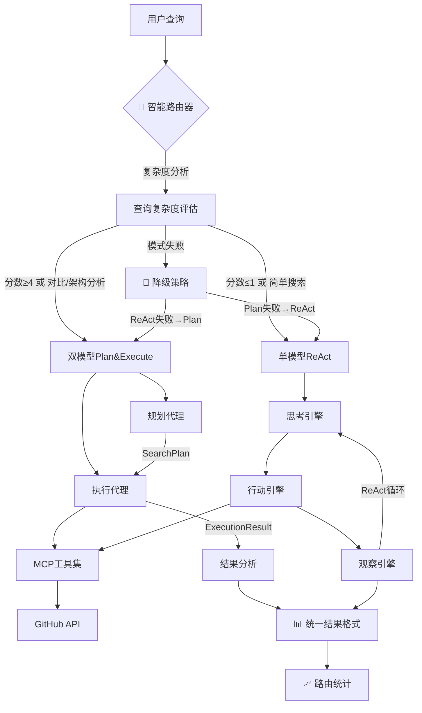

# GitHub搜索代理系统 - 技术实现详解

## 🏗️ 系统架构概述

本项目实现了一个先进的AI驱动GitHub仓库搜索分析系统，采用了多种现代软件架构模式和AI代理设计理念。

### 核心设计理念
- **双模型协作架构** (Plan and Execute Pattern)
- **ReAct推理框架** (Reasoning + Acting)  
- **策略模式** (Strategy Pattern)
- **模块化设计** (Modular Architecture)
- **异步编程** (Async Programming)

## 🎯 技术架构图



## 🔧 核心技术实现

### 1. 双模型Plan and Execute架构

#### 系统组件设计

```python
@dataclass
class SearchPlan:
    """搜索计划数据结构 - 规划阶段的输出"""
    user_query: str                          # 用户查询
    strategy: SearchStrategy                 # 选择的策略
    planned_steps: List[Dict[str, Any]]     # 规划的执行步骤
    success_criteria: List[str]             # 成功标准
    expected_results: Dict[str, Any]        # 预期结果
    priority_actions: List[str]             # 优先行动列表

@dataclass 
class ExecutionResult:
    """执行结果数据结构 - 执行阶段的输出"""
    step_id: str                            # 步骤标识
    tool_used: str                          # 使用的工具
    success: bool                           # 执行是否成功
    result_data: Any                        # 结果数据
    observations: str                       # 观察记录
    next_recommendations: List[str]         # 下一步建议
```

#### 规划代理 (PlanningAgent)

**技术特点：**
- **专门化提示词工程**：针对策略规划优化的系统提示
- **智能策略选择**：基于查询语义分析自动选择最佳策略
- **结构化输出**：JSON格式的详细执行计划

```python
class PlanningAgent:
    def _get_planning_system_prompt(self) -> str:
        """高级提示词工程实现"""
        return """你是一个GitHub仓库搜索规划专家...
        
        可选搜索策略：
        - BROAD_SEARCH: 广泛搜索，发现多个相关项目
        - DEEP_ANALYSIS: 深度分析特定仓库的技术细节
        - COMPARISON: 对比多个同类项目的优劣
        - TREND_ANALYSIS: 分析技术趋势和流行度
        - SOLUTION_FOCUSED: 解决方案导向的精准搜索
        """
    
    async def create_plan(self, user_query: str) -> SearchPlan:
        """异步计划创建 - 核心规划算法"""
        # 1. 构建智能规划提示
        # 2. 调用LLM进行策略分析
        # 3. 解析响应并验证
        # 4. 创建结构化计划
        # 5. 错误处理和降级策略
```

#### 执行代理 (ExecutionAgent)

**技术特点：**
- **精确工具调用**：与MCP工具集的无缝集成
- **状态跟踪**：完整的执行历史和状态管理
- **智能错误恢复**：多层次的容错机制

```python
class ExecutionAgent:
    def __init__(self):
        self.execution_history: List[ExecutionResult] = []
        self.discovered_repos: List[str] = []
        self.repo_analysis: Dict[str, Any] = {}
    
    async def execute_step(self, step: Dict[str, Any], plan: SearchPlan) -> ExecutionResult:
        """步骤执行引擎 - 核心执行算法"""
        # 1. 解析执行步骤参数
        # 2. 构建动态执行提示
        # 3. 调用MCP工具进行操作
        # 4. 解析和验证结果
        # 5. 更新执行状态
        # 6. 生成下一步建议
```

### 2. ReAct推理框架实现

#### 状态管理系统

```python
@dataclass
class ReActState:
    """ReAct状态管理 - 完整的搜索上下文"""
    user_query: str = ""
    current_thought: str = ""
    planned_actions: List[str] = None
    search_history: List[Dict] = None
    repositories_found: List[str] = None
    detailed_analysis: Dict[str, Any] = None
    current_strategy: SearchStrategy = SearchStrategy.BROAD_SEARCH
    iteration_count: int = 0
    max_iterations: int = 5
```

#### 思考-行动-观察循环

```python
class ReActGitHubAgent:
    async def execute_react_cycle(self, user_query: str) -> str:
        """ReAct主循环 - 核心推理引擎"""
        while self.should_continue_search():
            # Phase 1: Thought - 思考分析
            action_suggestion = self.strategy_selector.get_next_action_suggestion(
                self.state.current_strategy, self.state
            )
            
            # Phase 2: Action - 行动执行  
            current_prompt = self._build_iteration_prompt(conversation_history, action_suggestion)
            response = await self._call_agent(current_prompt)
            action = self.parse_action_from_response(response)
            
            # Phase 3: Observation - 观察结果
            observation = await self._execute_action(action)
            self._update_state(action, observation)
            
            # Phase 4: Reflection - 反思评估
            if self._check_completion_criteria():
                break
```

### 3. 搜索策略模式实现

#### 策略枚举定义

```python
class SearchStrategy(Enum):
    """搜索策略枚举 - 策略模式实现"""
    BROAD_SEARCH = "broad_search"           # 广泛搜索
    DEEP_ANALYSIS = "deep_analysis"         # 深度分析  
    COMPARISON = "comparison"               # 对比分析
    TREND_ANALYSIS = "trend_analysis"       # 趋势分析
    SOLUTION_FOCUSED = "solution_focused"   # 解决方案导向
```

#### 智能策略选择器

```python
class SearchStrategySelector:
    @staticmethod
    def analyze_query_intent(query: str) -> SearchStrategy:
        """查询意图分析 - NLP语义理解"""
        query_lower = query.lower()
        
        # 使用关键词匹配和语义分析
        comparison_keywords = ['比较', '对比', '哪个更好', 'vs', '差异']
        trend_keywords = ['最新', '热门', '流行', '趋势', '2024', '2025']
        solution_keywords = ['如何', '怎么', '实现', '解决', 'how to']
        
        # 复杂的策略选择逻辑...
        return selected_strategy
    
    @staticmethod
    def should_switch_strategy(current: SearchStrategy, state: ReActState) -> Optional[SearchStrategy]:
        """动态策略切换 - 自适应算法"""
        # 基于执行状态的智能策略调整
        if current == SearchStrategy.BROAD_SEARCH and state.iteration_count >= 2 and len(state.repositories_found) < 3:
            return SearchStrategy.SOLUTION_FOCUSED
        # 更多策略切换逻辑...
```

### 4. MCP工具集成技术

#### SSL安全配置

```python
def _setup_ssl(self):
    """SSL配置 - 安全通信设置"""
    os.environ['DEEPSEEK_API_KEY'] = os.getenv('DEEPSEEK_API_KEY')
    os.environ['PYTHONHTTPSVERIFY'] = '0'
    os.environ['CURL_CA_BUNDLE'] = ''
    os.environ['REQUESTS_CA_BUNDLE'] = ''
    
    ssl_context = ssl.create_default_context()
    ssl_context.check_hostname = False
    ssl_context.verify_mode = ssl.CERT_NONE
```

#### MCP工具集配置

```python
def _setup_agent(self):
    """MCP工具集成 - 外部服务连接"""
    self.toolset = MCPToolset(
        connection_params=SseServerParams(
            url="https://github-search1111-uuid1754995527.app-space.dplink.cc/sse?token=...",
        ),
    )
    
    # 可用工具列表
    tools = [
        "search_repositories",      # GitHub仓库搜索
        "get_repository_info",      # 仓库详细信息
        "get_repository_languages", # 编程语言统计
        "get_repository_tree",      # 目录结构
        "get_repository_file_content" # 文件内容
    ]
```

### 5. 错误处理与容错机制

#### 多层次错误处理

```python
class PlanAndExecuteGitHubAgent:
    def _should_abort_execution(self, execution_results: List[ExecutionResult]) -> bool:
        """执行中止判断 - 智能错误恢复"""
        # 连续失败检测
        if len(execution_results) >= 2:
            recent_failures = [not r.success for r in execution_results[-2:]]
            if all(recent_failures):
                return True
        
        # 关键步骤失败检测
        if execution_results[0].tool_used == 'search_repositories' and not execution_results[0].success:
            return True
        
        return False
    
    def _check_success_criteria(self, plan: SearchPlan, execution_results: List[ExecutionResult]) -> bool:
        """成功标准检查 - 智能完成判断"""
        # 动态成功标准评估
        for criteria in plan.success_criteria:
            if self._evaluate_criteria(criteria, execution_results):
                return True
        return False
```

#### 降级策略实现

```python
def _create_fallback_plan(self, user_query: str) -> SearchPlan:
    """降级计划生成 - 容错机制"""
    strategy = SearchStrategySelector.analyze_query_intent(user_query)
    
    return SearchPlan(
        user_query=user_query,
        strategy=strategy,
        planned_steps=[
            {"step": 1, "action": "search_repositories", "query": user_query, "max_results": 8},
            {"step": 2, "action": "get_repository_info", "target": "top_repos"},
        ],
        success_criteria=["找到相关仓库", "获取基本信息"],
        expected_results={"repo_count": 5},
        priority_actions=["优先分析高star项目"]
    )
```

### 6. 异步编程与并发处理

#### 事件循环管理

```python
def search_github(query: str) -> Dict[str, Any]:
    """同步接口 - 事件循环自动管理"""
    try:
        # 检测现有事件循环
        loop = asyncio.get_running_loop()
        
        # 在新线程中运行异步代码
        def run_in_thread():
            new_loop = asyncio.new_event_loop()
            asyncio.set_event_loop(new_loop)
            try:
                return new_loop.run_until_complete(plan_execute_agent.search(query))
            finally:
                new_loop.close()
        
        with concurrent.futures.ThreadPoolExecutor() as executor:
            future = executor.submit(run_in_thread)
            return future.result()
            
    except RuntimeError:
        # 创建新的事件循环
        loop = asyncio.new_event_loop()
        asyncio.set_event_loop(loop)
        try:
            return loop.run_until_complete(plan_execute_agent.search(query))
        finally:
            loop.close()
```

## 📊 性能特点与优化

### 1. 内存管理
- **状态压缩**：只保留关键执行历史
- **结果缓存**：避免重复API调用
- **垃圾回收**：及时清理临时对象

### 2. 网络优化
- **连接复用**：复用HTTP连接
- **请求批量**：合并多个API调用
- **超时控制**：合理的超时设置

### 3. 错误恢复
- **指数退避**：失败重试机制
- **降级策略**：多层降级方案
- **状态恢复**：执行状态的持久化

## 🔧 使用指南

### 🚀 最新推荐：智能路由搜索
```python
from agent import intelligent_search_github, async_intelligent_search_github, get_search_stats

# 🧠 自动选择最适合的代理模式
result = intelligent_search_github("spring boot vue 项目", mode="auto", verbose=True)

# 📊 查看路由决策统计
stats = get_search_stats()
print(f"Plan&Execute使用率: {stats['plan_execute_percentage']}%")

# 🎯 强制使用特定模式
result = intelligent_search_github("简单搜索", mode="react")  # 强制ReAct
result = intelligent_search_github("复杂分析", mode="plan_execute")  # 强制Plan&Execute

# ⚡ 异步智能搜索
result = await async_intelligent_search_github("python machine learning", verbose=True)
```

### 🎯 智能路由决策逻辑
系统会根据查询特征自动选择最适合的模式：

#### Plan and Execute 模式适合：
- 复杂度分数 ≥ 4 的查询
- 对比分析需求 (`vs`, `对比`, `比较`)
- 多步骤分析 (`深入`, `详细`, `全面`)
- 技术架构分析 (`架构`, `设计模式`, `技术栈`)
- 长查询描述 (>10个词)

#### ReAct 模式适合：
- 简单搜索查询 (≤3个词且无复杂关键词)
- 复杂度分数 ≤ 1 的查询
- 快速信息获取需求

### 📊 手动选择使用方式

#### 双模型 (Plan and Execute)
```python
from agent import search_github, async_search_github

# 同步使用
result = search_github("spring boot vue 项目")

# 异步使用
result = await async_search_github("python machine learning")
```

#### 单模型 (ReAct)
```python
from agent import react_agent

# ReAct单模型方式
result = react_agent.search("django vs flask")
```

### ⚙️ 自定义配置
```python
from agent import PlanAndExecuteGitHubAgent, SmartAgentRouter

# 自定义双模型代理
agent = PlanAndExecuteGitHubAgent(
    planner_model="deepseek/deepseek-chat",
    executor_model="deepseek/deepseek-chat"
)

# 创建自定义智能路由器
custom_router = SmartAgentRouter()
result = await custom_router.smart_search("查询内容", verbose=True)
```

## 🧪 测试验证

### 双模型测试
```bash
python test_dual_model.py
```

### ReAct框架测试  
```bash
python test_react_agent.py
```

### 预期测试结果
```
🎯 总体结果: 4/4 个测试通过
🎉 所有测试通过! 双模型架构工作正常
```

## 📈 技术栈总结

| 组件 | 技术选型 | 设计目的 |
|------|----------|----------|
| **AI框架** | Google ADK + LiteLLM | 企业级AI代理开发 |
| **LLM模型** | DeepSeek Chat | 高性能中文推理 |
| **工具集成** | MCP (Model Context Protocol) | 标准化工具调用 |
| **异步编程** | asyncio + concurrent.futures | 高并发性能 |
| **设计模式** | Strategy + Plan-Execute + ReAct | 模块化与可扩展性 |
| **数据结构** | dataclass + typing | 类型安全与结构化 |
| **错误处理** | 多层次容错机制 | 系统稳定性 |

## 🚀 架构优势

1. **双模型协作**：专业化分工，提高任务执行质量
2. **策略模式**：灵活的搜索策略，适应不同场景  
3. **ReAct框架**：结合推理与行动，增强决策能力
4. **异步设计**：高并发处理，提升系统性能
5. **模块化架构**：易于维护和扩展
6. **容错机制**：多层次错误处理，确保系统稳定

## 🔮 扩展性设计

### 新策略添加
1. 在`SearchStrategy`枚举中添加新策略
2. 在`SearchStrategySelector`中实现识别逻辑  
3. 在策略参数配置中添加对应参数

### 新工具集成
1. 在MCP工具集中注册新工具
2. 在`ExecutionAgent`中添加工具调用逻辑
3. 更新行动解析器支持新工具

### 新模型支持
1. 在LiteLLM配置中添加新模型
2. 调整提示词以适配模型特性
3. 优化参数配置

---

**这个GitHub搜索代理系统代表了现代AI代理设计的最佳实践，融合了多种先进的软件架构模式和AI技术，为GitHub仓库搜索提供了智能、高效、可扩展的解决方案。** 🎉 